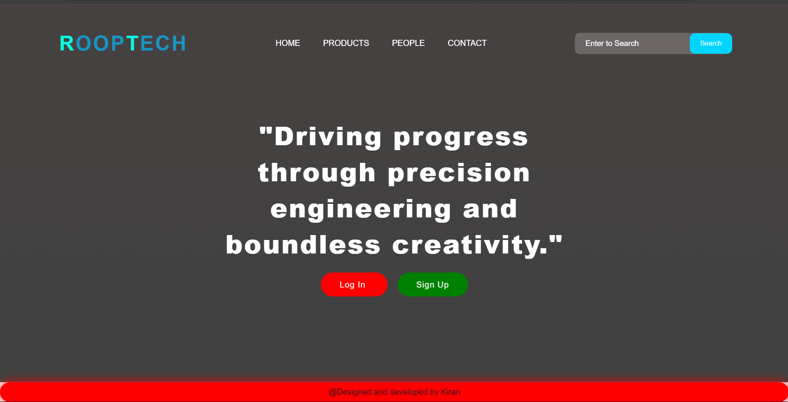
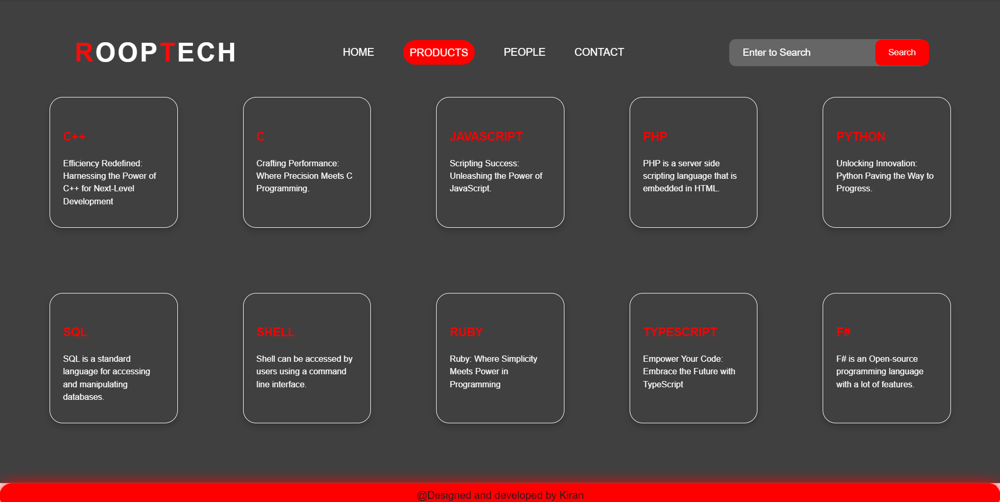
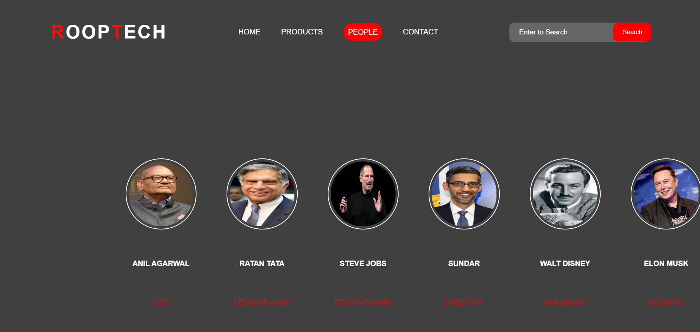
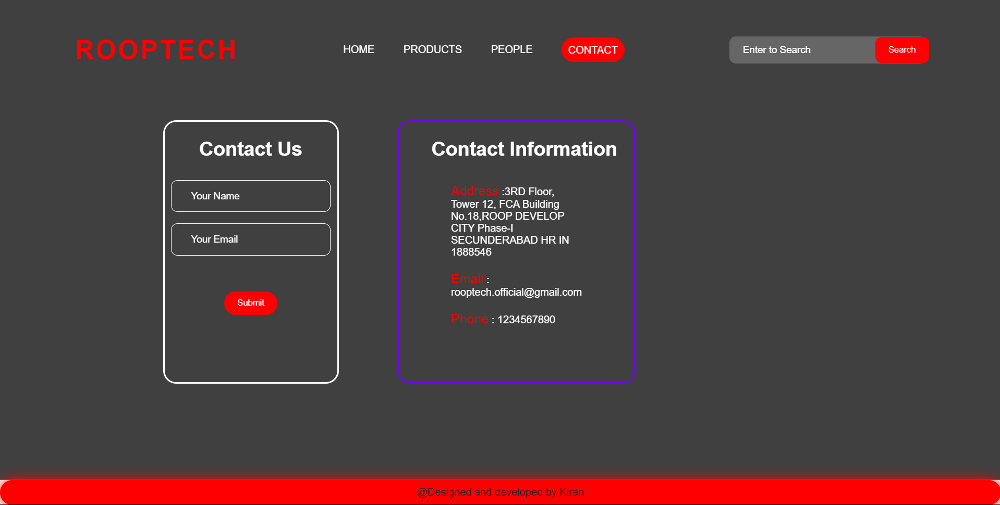

# Simple Website Project
## Project Overview
This project is a simple website featuring a Home page, Council page, Product page, and Contact Us page. The website is styled using basic CSS to ensure a consistent and appealing look across all pages.

## Directory Structue
simple-website/
├── index.html
├── council.html
├── product.html
├── contact.html

## Requirements
To view and edit this project, you need a text editor (such as VSCode, Sublime Text, or Notepad++) and a web browser (such as Chrome, Firefox, or Edge).

## OUTPUT HOME :

## OUTPUT PRODUCT :

## OUTPUT PEOPLE :

## OUTPUT CONTACT :

